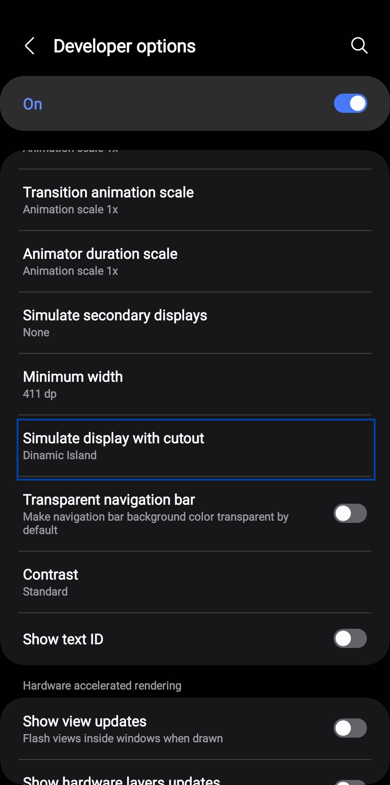
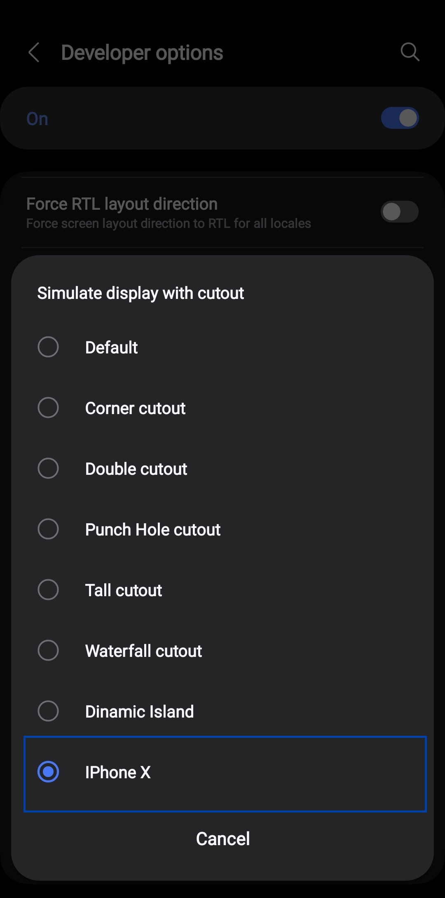

# Magisk-iPhoneX-Cutout-Overlay
Module for Magisk to enable style of Notch (Curtou) like iPhone X version on Android Rooted device

# How to use
* Install this module, and reboot the phone.
* Access Settings > Developer Options
* And find this option in image to enable the notch.

First

Second

